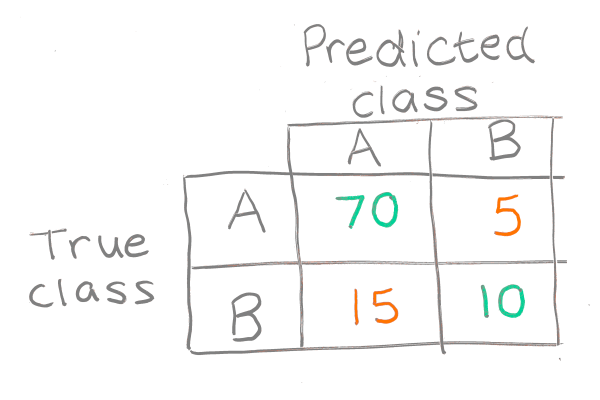

# Overview of processes

Roughly in chronological order.

Project symbols:
+ 🍌 General
+ 🛳️ Titanic
+ 🧠 SAMueL-1, SAMueL-2

## Planning

### What do you want to predict?

__Classification / regression__

| Model type | What is this? | Why bother? | Example | References |
| --- | --- | --- | --- | --- |
| Regression | (❓?) | (❓?) |  |  |
| Single-class classification | (❓?) | (❓?) |  |  |
| Multi-class classification | (❓?) | (❓?) |  |  |

### What does your data need to look like to predict this?

Assume tabular.

+ Data format

+ Data types handling
  + OHE
  + ordinal

(different model types can handle categorical data differently...)

+ e.g. condense multiple OHE columns into one ordinal one - change time 0-90, 90-180, 180-270... to a single continuous time column.
+ Bool is ok, 0 and 1 better.

## Initial data processing

+ Data loading

### Keeping track

__Data format__

| What is this? | Why bother? | Example | References |
| --- | --- | --- | --- |
| (❓?) | (❓?) |  |     |

__Logs__

| What is this? | Why bother? | Example | References |
| --- | --- | --- | --- |
| (❓?) | (❓?) |  |     |

### Clean up the data

| Method | What is this? | Why bother? | Example | References |
| --- | --- | --- | --- | --- |
| __Imputation__ |  Filling in missing data by comparison with existing data. | The model might treat missing data as though normal valid data. |  | [🛳️][titanic-impute]    |
| __Cleaning__ | Condense data into simpler data types and more practical categories. | The data is easier for humans to interpret and is more precise for machine learning. |  | [🛳️][titanic-cleaning]    |
| __Impossibilities__ | Alter or remove impossible data points. | A model trained on bad data will produce bad results. |  |     |
| __Censoring__ | Remove data points that lie outside a chosen range. | Data with rare or extreme values are more easily used to identify individual patients. |  |     |

### Is the data statistically sound?

| Method | What is this? | Why bother? | Example | References |
| --- | --- | --- | --- | --- |
| __Covariance__ | Measure how closely linked each pair of features are. As one of the pair increases in value, does the other one consistently increase too? | (❓?). |  |   [🧠][samuel1-covariance] [🧠][samuel2-correlation] |
| __Descriptive statistics__ | The averages and spreads of values for each feature of the data. | This quantifies the acceptable limits for use with the data cleaning process. |  |   [🧠][samuel1-descriptivestats]  |
| __Normalisation / standardisation__ | Removes the dimensions (units of length, time etc.) from the data. Each list of data then has a mean of zero and standard deviation of one. | The spread of values for different features can be compared more fairly. Helps to generate synthetic data. |  | [🛳️][titanic-standardise]    |

### Would more "fake" data be useful?

| Method | What is this? | Why bother? | Example | References |
| --- | --- | --- | --- | --- |
| __Synthetic data__ | Generate extra data points based on the existing data. | To replace the real patient data and so avoid privacy concerns. |  | [🛳️][titanic-synthetic]    |
| __Oversampling__ | Generate extra data points based on a subset of the existing data. | To create more examples of an under-represented group of data.  |  | [🛳️][titanic-oversampling]    |

## Fitting

### Selecting the model

| Method | What is this? | Why bother? | Example | References |
| --- | --- | --- | --- | --- |
| __Logistic regression__ | (❓?) | (❓?) |  |     |
| __Neural network__ | (❓?) | (❓?) |  |     |
| __Random forest__ | (❓?) | (❓?) |  |     |

### Optimisation

| Method | What is this? | Why bother? | Example | References |
| --- | --- | --- | --- | --- |
| __ADAM (sp?), gradient descent, built-ins...__ | (❓?) | (❓?) |  |     |
| __Holdout__ | (❓? precisely) | Prevents over-fitting. |  |     |
| __Regularisation__ | (❓? precisely) | Prevents over-fitting. |  |     |
| __Learning rate__ | Train the model multiple times with increasing amounts of training data. | Find how much data is needed before accuracy stops increasing. |  | [🛳️][titanic-learningrate] [🧠][samuel1-learningrate] |

### Prepare the data for modelling

| Method | What is this? | Why bother? | Example | References |
| --- | --- | --- | --- | --- |
| __Train and test split__ |  Split the data into a large training group and a small testing group. | The training data is used to teach the model. The testing data is used to test the model's performance on previously unseen data. |  | [🛳️][titanic-traintest]    |
| __k-fold__ | (❓? precisely) | (❓? precisely) |  | [🍌][samuel1-kfold] [🛳️][titanic-kfold] |
| __Feature selection__ | Reduce the dataset to only the most important features. | The model is less complex and so it is easier to explain its thinking. |  | [🛳️][titanic-featureselection] [🧠][samuel1-featureimportance] [🧠][samuel2-featureselection] |

### Testing: How well is the model performing?

| Method | What is this? | Why bother? | Example | References |
| --- | --- | --- | --- | --- |
| __Accuracy__ | How often does the model predict the correct value in the test data? There are various measures including sensitivity, specificity, ... | The best model will have the best possible accuracy, e.g. fewest false negatives. |  | [🛳️][titanic-accuracy] [🛳️][titanic-accuracy-logistic]  [🧠][samuel1-accuracy] [🧠][samuel2-accuracy] |
| __Confusion matrix__ | A table of predicted vs real values in the test data. | Easy way to see numbers or proportions of true positives, false positives etc. |  |     |
| __Calibration__ | (❓?) | (❓?) |  |     |

## Validation

| Method | What is this? | Why bother? | Example | References |
| --- | --- | --- | --- | --- |
| __Bootstrap__ | Create multiple versions of the model all trained on different data and compare their predictions. | Uncertainty measure from consistency of predictions. |  | [🛳️][titanic-bootstrap]    |
| __Conformal prediction__ | (❓? to do with prediction intervals) | (❓? to do with wiggle room) |  |     |
| __SHAP__ | Find each feature's contribution to the predicted value. The contribution depends on the feature value. | Find which features are most important. |  | [🍌][samuel2-shapgeneric] [🛳️][titanic-shap] [🛳️][samuel2-shaptitanic] [🧠][samuel1-shap] [🧠][samuel2-shap]  | |
| __SHAP interactions__ | Separate out the other features' contributions to that feature's contribution to the predicted value. | See how different features combine and influence each other. |  | [🛳️][titanic-shapinteractions] [🛳️][samuel2-shapinteractionstitanic] |
| __Key counterfactuals__ | Find the smallest change to the input data that would change the model's prediction. | Does the change make sense, and so is the model trustworthy? |  |     |

## Usage

+ New predictions
+ Uncertainty and accuracy of new predictions
+ Reports
  + What are the important things to report? 

| Thing to report | What is this? | Why bother? | Example | References |
| --- | --- | --- | --- | --- |
| __Model accuracy__ | Measures of accuracy, false positive rate etc. | Provides faith in the results. |  | [🛳️][titanic-accuracy] [🛳️][titanic-accuracy-logistic]  [🧠][samuel1-accuracy] [🧠][samuel2-accuracy] |

[titanic-impute]: https://michaelallen1966.github.io/titanic/01_preprocessing.html#filling-in-imputing-missing-data
[titanic-cleaning]: https://michaelallen1966.github.io/titanic/01_preprocessing.html
[titanic-synthetic]: https://michaelallen1966.github.io/titanic/30_synthetic_data.html
[titanic-oversampling]: https://michaelallen1966.github.io/titanic/14_imbalanced%20_data_sampling.html
[titanic-standardise]: https://michaelallen1966.github.io/titanic/02_logistic_regression.html#standardise-data
[titanic-learningrate]: https://michaelallen1966.github.io/titanic/07_learning_curve.html
[titanic-traintest]: https://michaelallen1966.github.io/titanic/02_logistic_regression.html#divide-into-x-features-and-y-labels
[titanic-kfold]: https://michaelallen1966.github.io/titanic/03_k_fold.html
[titanic-featureselection]: https://michaelallen1966.github.io/titanic/10_feature_selection_2_forward.html
[titanic-accuracy]: https://michaelallen1966.github.io/titanic/05_accuracy_standalone.html
[titanic-accuracy-logistic]: https://michaelallen1966.github.io/titanic/06_accuracy_logistic_regression.html
[titanic-bootstrap]: https://michaelallen1966.github.io/titanic/53_bagging.html
[titanic-shap]: https://michaelallen1966.github.io/titanic/27_random_forest_shap.html
[titanic-shapinteractions]: https://michaelallen1966.github.io/titanic/90_shap_interactions_on_titanic.html

[samuel1-descriptivestats]: https://samuel-book.github.io/samuel-1/descriptive_stats/01_descriptive.html
[samuel1-covariance]: https://samuel-book.github.io/samuel-1/descriptive_stats/07_covariance.html
[samuel1-learningrate]: https://samuel-book.github.io/samuel-1/random_forest/random_forest_single_fit.html#learning-cvurve
[samuel1-kfold]: https://samuel-book.github.io/samuel-1/introduction/kfold.html
[samuel1-featureimportance]: https://samuel-book.github.io/samuel-1/random_forest/random_forest_single_fit.html#feature-importances
[samuel1-accuracy]: https://samuel-book.github.io/samuel-1/random_forest/random_forest_single_fit.html#results
[samuel1-shap]: https://samuel-book.github.io/samuel-1/random_forest/characterise_contentious_patients.html#shap-bee-swarm-plot

[samuel2-correlation]: https://samuel-book.github.io/samuel-2/samuel_shap_paper_1/xgb_with_feature_selection/07_correlation.html
[samuel2-featureselection]: https://samuel-book.github.io/samuel-2/samuel_shap_paper_1/xgb_with_feature_selection/01_xgb_combined_fit_feature_selection.html
[samuel2-accuracy]: https://samuel-book.github.io/samuel-2/samuel_shap_paper_1/xgb_with_feature_selection/02_xgb_combined_fit_accuracy_key_features.html
[samuel2-shapgeneric]: https://samuel-book.github.io/samuel-2/samuel_shap_paper_1/shap_worked_example.html
[samuel2-shaptitanic]: https://samuel-book.github.io/samuel-2/samuel_shap_paper_1/xgb_with_feature_selection/90_shap_interactions_on_titanic.html
[samuel2-shapinteractionstitanic]: https://samuel-book.github.io/samuel-2/samuel_shap_paper_1/xgb_with_feature_selection/90_shap_interactions_on_titanic.html#grid-of-shap-dependence-plots
[samuel2-shap]: https://samuel-book.github.io/samuel-2/samuel_shap_paper_1/xgb_with_feature_selection/03_xgb_combined_shap_key_features.html